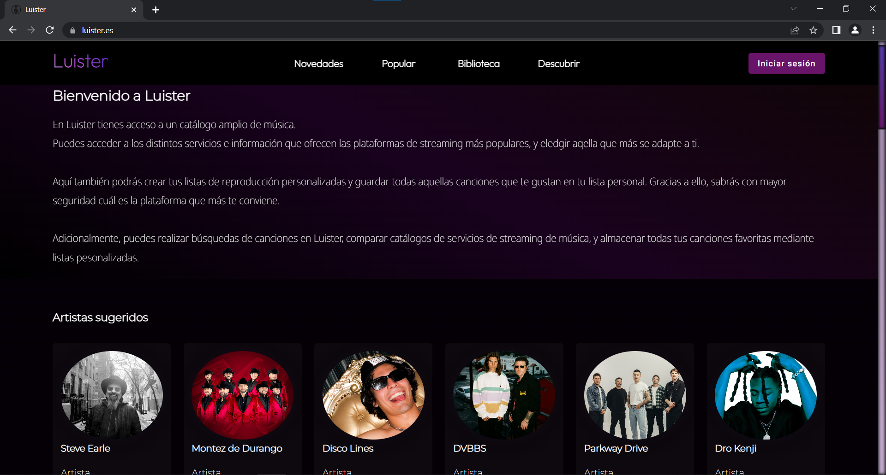
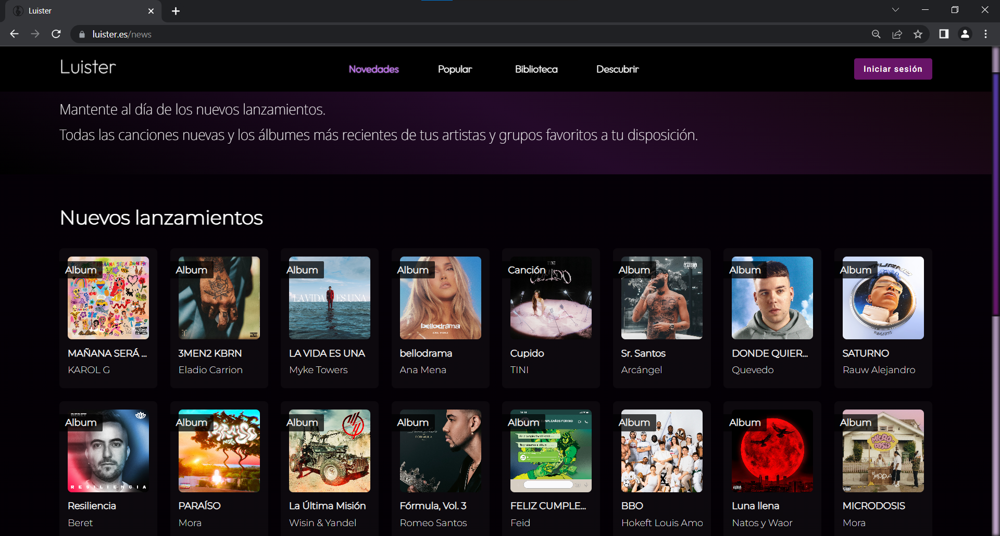
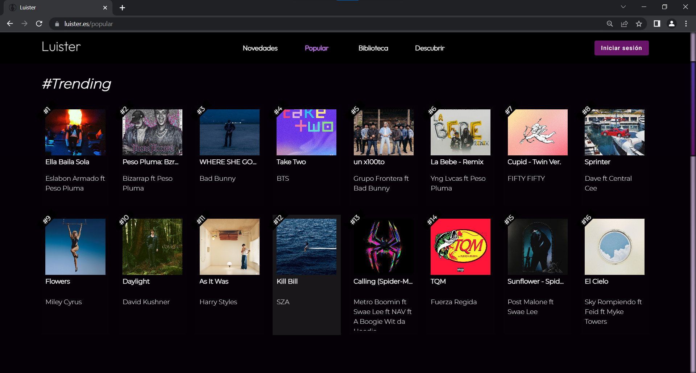
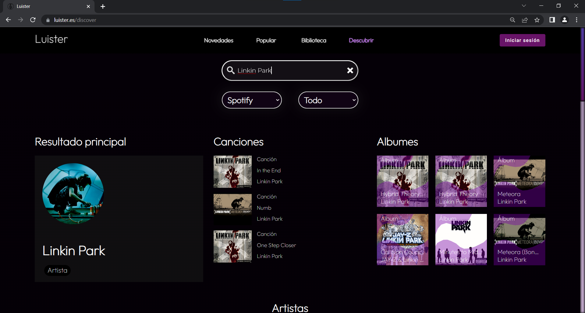
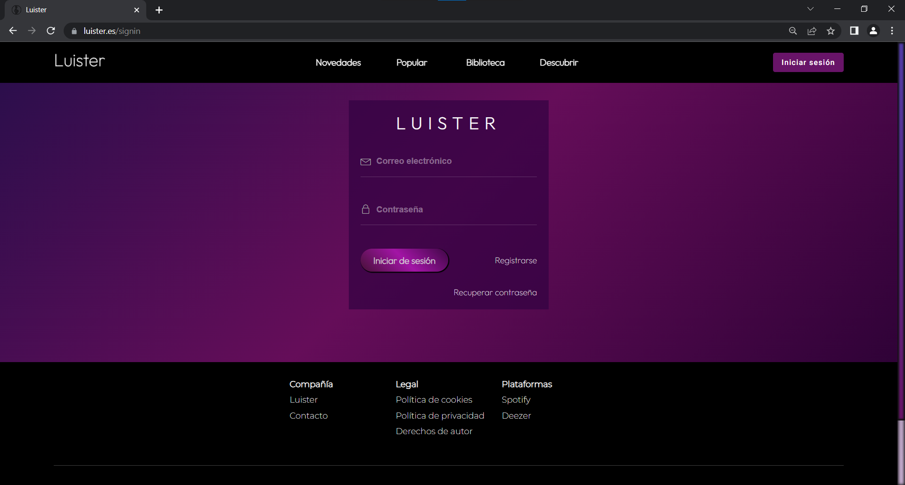
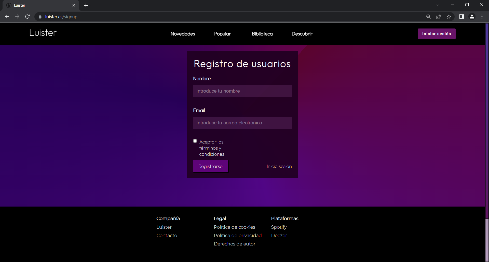
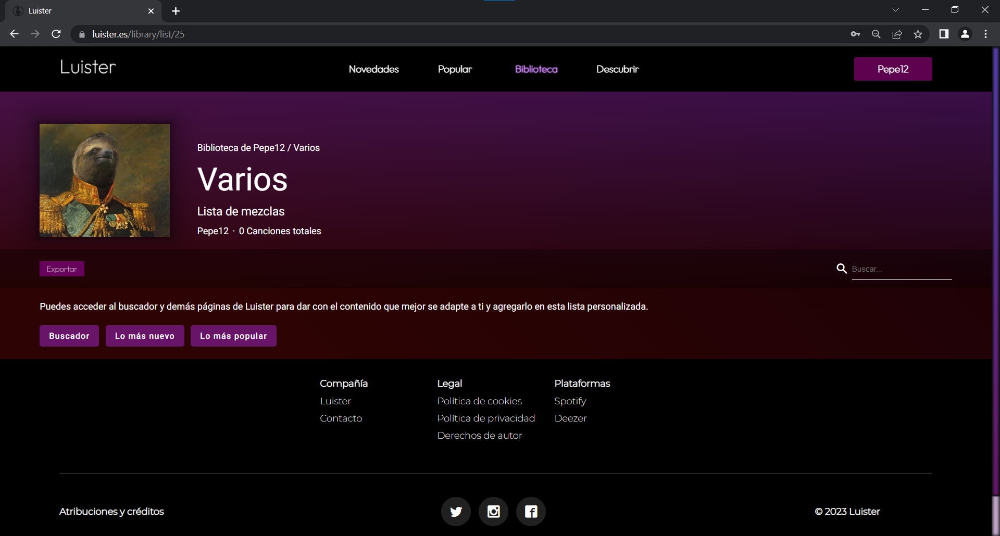
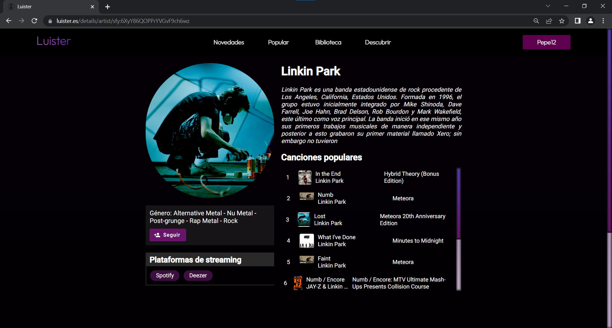

# Luister
Significa escuchar en afrikaans. Es una página cuya temática es la música.
En Luister podrás:
- Gestionar tu biblioteca musical (sólo para usuarios registrados).
- Consultar las novedades de tus artistas favoritos.
- Consultar el contenido más popular.

## Objetivos de Luister
- Aplicación práctica de los conocimientos adquiridos durante la realización de CFGS DAW.
- Ofrecer una aplicación web en donde los amantes de la música puedan gestionar su biblioteca musical sin depender de una plataforma de streaming en concreto.

# Versiones 

Django 4.1.7
Django Rest Framework 3.14.0

Node.js v18.16.0
npm 9.6.5

Angular CLI 15.2.6

## Interfaz

Pantalla de inicio

Novedades

Popular

Descubrir

Página de inicio de sesión

Página de registro

Lista sin contenido

Detalles de Artistas

## Plataformas implementadas por el momento
### Spotify
### Deezer
